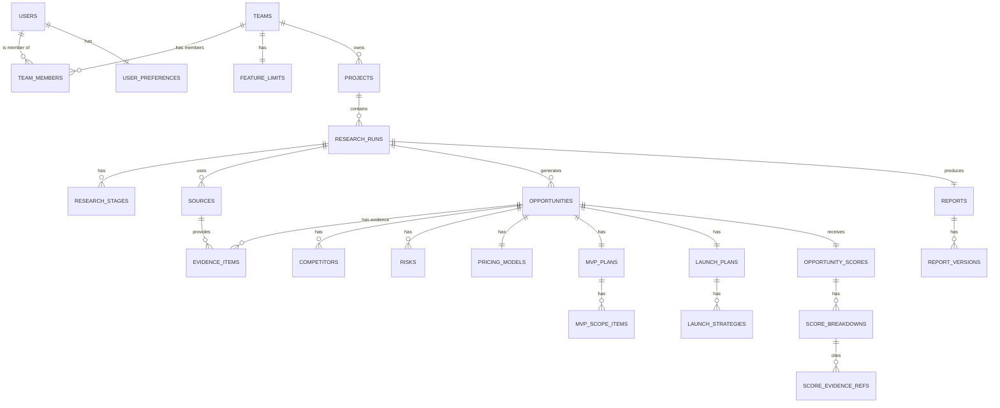

# SignalFit Backend Architecture & Persistence Layer

Welcome to the central repository of truth for the SignalFit backend. This document explains the entire database, API structure, authentication flows, and storage architecture. 

This backend is built for a production SaaS application. It strictly avoids generic JSON blob storage (except where absolutely necessary for unstructured caching or snapshots), enforces data integrity through PostgreSQL constraints, and uses Row Level Security (RLS) to ensure tenant isolation.

---

## 1. Architecture Overview

**Tech Stack:**
*   **Database:** PostgreSQL (via Supabase)
*   **Auth:** Supabase Auth (Email/Password, OAuth)
*   **Backend Runtime:** Next.js Server Actions (App Router)
*   **Type Safety:** End-to-end via TypeScript, Zod, and typed Supabase JS client.

**Database Philosophy:**
*   **Highly Normalized:** Everything that has relationships or is queried independently is an entity (e.g., `opportunities`, `evidence_items`, `competitors`).
*   **Migration-Safe:** Schema changes happen via incremental SQL files in `supabase/migrations/`, not by mutating the database directly in a UI.
*   **Team-Centric (Multi-tenant):** Every user belongs to a `team`. Projects and billing belong to a `team`. This future-proofs the application for B2B features.
*   **Implicit Security:** RLS policies ensure that even if an API bug occurs, a user cannot fetch data belonging to a different team.

---

## 2. Entity Relationship Diagram (ERD)



---

## 3. Database Schema

The schema is built across 6 numbered migrations.

### `00001_core_iam` (Identity & Access Management)
*   **`users`**: Mirrors `auth.users`. Contains `display_name`, `avatar_url`, `onboarding_completed`.
*   **`teams`**: Represents a billing/collaboration boundary.
*   **`team_members`**: Link table. `role` enum (`owner`, `admin`, `member`).
*   **`user_preferences`**: Market preferences, experience levels, UI themes.
*   **`feature_limits`**: Tracks limits (max projects, runs) per team.

### `00002_projects_research`
*   **`projects`**: High-level folders. Linked to a team.
*   **`research_runs`**: Core tracking for a validation attempt. Contains progress, status, mode, idea description.
*   **`research_stages`**: Steps of a run (e.g., "Scraping", "Analyzing").
*   **`saved_comparisons`**: Saved views comparing multiple runs.

### `00003_normalized_data`
*   **`opportunities`**: The structured idea validated by the system.
*   **`sources`**: Raw web pages or inputs.
*   **`evidence_items`**: Factoids extracted from sources.
*   **`competitors`, `risks`, `pricing_models`, `mvp_plans`, `launch_plans`**: All linked directly to the parent `opportunity`.

### `00004_scoring_reports`
*   **`opportunity_scores`**: The aggregate validation score.
*   **`score_breakdowns`**: Granular scores per criterion.
*   **`score_evidence_refs`**: Links a breakdown to exact `evidence_items`.
*   **`reports`**: The finalized, viewable asset.
*   **`report_versions`**: JSON snapshots of a report at a specific time (useful for immutable history).

### `00005_system_billing`
*   **`analytics_events`**: Tracks user actions.
*   **`error_logs`**: System errors.
*   **`background_jobs`**: State of edge functions.
*   **`notifications`**: User alerts.
*   **`cached_research` & `search_cache`**: Caching layer for LLM and SERP API calls.
*   **`billing_customers` & `billing_subscriptions`**: Stripe mapping.

### `00006_triggers_functions`
*   **`update_modified_column()`**: Keeps `updated_at` accurate on every row.
*   **`handle_new_user()`**: Automatically triggers when a user signs up. Syncs `users` table, creates a default `team`, assigns `team_members` owner role, and setups `feature_limits`.

---

## 4. API & Backend Logic (Server Actions)

We use Next.js Server Actions to mutate data securely. They are located in `lib/actions/`.

*   **`teams.ts`**: `getTeamInfo()`, `getUserProfile()`, `updateUserProfile()`.
*   **`research.ts`**: `createProject()`, `startResearchRun()`, `getResearchRuns()`.
*   **`evidence.ts`**: `addEvidence()`, `toggleEvidenceVerification()`.
*   **`reports.ts`**: `getReportForRun()`, `publishReport()`, `createReportVersion()`.

**Security Note:** Every server action initializes the Supabase client using `lib/supabase/server.ts` which respects the user's cookie session. RLS handles authorization automatically.

---

## 5. Lifecycles

### Authentication & Onboarding
1. User signs up via Supabase UI / Google OAuth.
2. `auth.users` row is inserted.
3. Trigger `handle_new_user()` runs in Postgres.
4. User logs in. Frontend checks `onboarding_completed`.
5. If `false`, redirects to `/onboarding`.
6. User completes form -> calls `updateUserProfile` -> saves to `user_preferences`.

### Research Run Lifecycle
1. User clicks "Start Research" -> calls `startResearchRun` action.
2. `research_runs` row created. Status = `Queued`.
3. Background job picks up run, updates status to `Processing`.
4. Job fetches `sources`, creates `evidence_items`.
5. Job generates `opportunities`, `competitors`, `risks`, etc.
6. Job calculates `opportunity_scores`.
7. Run status = `Complete`. Frontend updates.

---

## 6. Storage Buckets

Defined in migration 00005.

*   `user-assets`: Public. For avatars, logos.
*   `exports`: Private. For generated PDF and CSV files.
*   `cached-sources`: Private. Raw HTML of scraped pages to prevent re-scraping and preserve evidence.

---

## 7. MANUAL SETUP REQUIRED

This backend relies on Supabase. Because you are deploying a production app, **you must manually perform the following steps** in your Supabase Dashboard:

### Step 1: Run the Migrations
The SQL files in `supabase/migrations/` need to be applied to your remote database.
*   If using the CLI locally: `supabase db push`
*   If using the Dashboard: Go to SQL Editor and copy/paste migrations 00001 through 00006 in order, running them one by one.
*   **Why:** Creates the tables, triggers, and policies.
*   **Verify:** Check the Table Editor in Supabase. You should see 28 tables.

### Step 2: Enable Edge Functions / Webhooks (Future)
When you build the Python/Node worker that actually does the AI research, you must set up a database webhook on the `research_runs` table that triggers on `INSERT`.
*   **Why:** Server Actions don't run long background processes.
*   **What Breaks:** If skipped, research runs stay in `Queued` forever.

### Step 3: Configure Authentication Providers
Go to Supabase -> Authentication -> Providers. Enable Google/GitHub if desired.
*   **Verify:** Ensure redirect URLs are correctly set to your production domain (e.g. `https://signalfit.com/auth/callback`).

### Step 4: Configure Storage (If migration fails)
Sometimes `insert into storage.buckets` requires `service_role` privileges and fails in standard SQL editor. If so:
*   Go to Supabase -> Storage.
*   Create buckets manually: `user-assets` (Public), `exports` (Private), `cached-sources` (Private).

### Step 5: Environment Variables
Ensure the following are set in your Vercel (or hosting) environment and `.env.local`:
```bash
NEXT_PUBLIC_SUPABASE_URL=your_project_url
NEXT_PUBLIC_SUPABASE_ANON_KEY=your_anon_key
# The service role key should ONLY be used in secure background workers, NEVER in the Next.js app or browser.
SUPABASE_SERVICE_ROLE_KEY=your_service_role_key
```

### Step 6: Verify Database Triggers
Go to Database -> Triggers in Supabase.
*   Ensure `on_auth_user_created` is attached to `auth.users` in the `auth` schema.
*   **Why:** If this fails, new users won't get a `public.users` row or a `team`, and the app will crash when they log in.

---

## 8. Troubleshooting & Common Pitfalls

*   **"Unauthorized / No Rows Returned":** 99% of the time, this is RLS. Ensure the user is actually logged in, and that the `team_members` table correctly links them to the team that owns the data.
*   **"Type Errors on Frontend":** If you add columns to Supabase, you MUST update `lib/types.ts` to match. 
*   **Null reference on Team:** If `getTeamInfo()` returns empty, the `handle_new_user` trigger likely failed during signup. Manually invoke the function or create the team.
