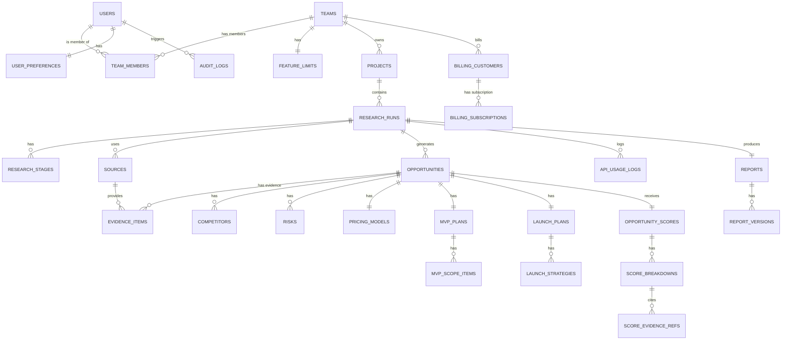

# SignalFit Backend Architecture & Persistence Layer

Welcome to the central repository of truth for the SignalFit backend. This document explains the entire database, API structure, authentication flows, storage architecture, and the complete Phase 1 hardening and security audit implementation.

This backend is built for a production SaaS application. It strictly avoids generic JSON blob storage (except where absolutely necessary for unstructured caching or snapshots), enforces data integrity through PostgreSQL constraints, uses Row Level Security (RLS) to ensure tenant isolation, and employs secure edge function workflows.

---

## 1. Architecture Overview

**Tech Stack:**
*   **Database:** PostgreSQL (via Supabase)
*   **Auth:** Supabase Auth (Email/Password, OAuth)
*   **Backend Runtime:** Next.js Server Actions (App Router)
*   **Background Jobs:** Supabase Edge Functions (Deno runtime)
*   **Type Safety:** End-to-end via TypeScript, Zod, and typed Supabase JS client.
*   **Architecture Pattern:** Repository Pattern (separates raw data access from Next.js server actions).

**Database Philosophy:**
*   **Highly Normalized:** Everything that has relationships or is queried independently is a distinct entity (e.g., `opportunities`, `evidence_items`, `competitors`).
*   **Migration-Driven Schema:** All schema changes are tracked incrementally in `supabase/migrations/` to guarantee repeatable migrations.
*   **Multi-Tenant (Team-Centric):** Every user belongs to a `team`. Projects, research runs, and billing belong to a `team`. This guarantees easy B2B scaling.
*   **Implicit Tenant Security:** Strict Row Level Security (RLS) policies are active on **all 33 tables** to ensure that data never leaks between teams.

---

## 2. Entity Relationship Diagram (ERD)



---

## 3. Canonical Table Reference (All 33 Tables)

Below is the exhaustive, production-grade column and schema specification for all 33 tables in the database:

### Group 1: Core IAM (Identity & Access Management)

#### 1. `users`
*   **Purpose:** Local cache of the core Supabase authentication profile.
*   **Columns:**
    *   `id` `uuid` (Primary Key, references `auth.users(id)` on delete cascade)
    *   `display_name` `text` (Nullable)
    *   `avatar_url` `text` (Nullable)
    *   `onboarding_completed` `boolean` (Default: `false`, Not Null)
    *   `created_at` `timestamptz` (Default: `now()`, Not Null)
    *   `updated_at` `timestamptz` (Default: `now()`, Not Null)

#### 2. `teams`
*   **Purpose:** Tenancy boundary for billing, users, projects, and runs.
*   **Columns:**
    *   `id` `uuid` (Primary Key, Default: `gen_random_uuid()`)
    *   `name` `text` (Not Null)
    *   `created_at` `timestamptz` (Default: `now()`, Not Null)
    *   `updated_at` `timestamptz` (Default: `now()`, Not Null)

#### 3. `team_members`
*   **Purpose:** Intersection table linking users to teams with role assignments.
*   **Columns:**
    *   `id` `uuid` (Primary Key, Default: `gen_random_uuid()`)
    *   `team_id` `uuid` (References `teams(id)` on delete cascade, Not Null)
    *   `user_id` `uuid` (References `users(id)` on delete cascade, Not Null)
    *   `role` `text` (Not Null, Check: `role IN ('owner', 'admin', 'member')`)
    *   `created_at` `timestamptz` (Default: `now()`, Not Null)
    *   `updated_at` `timestamptz` (Default: `now()`, Not Null)
*   **Unique Index:** `unique(team_id, user_id)`

#### 4. `user_preferences`
*   **Purpose:** User-specific configuration values and experience levels.
*   **Columns:**
    *   `id` `uuid` (Primary Key, Default: `gen_random_uuid()`)
    *   `user_id` `uuid` (References `users(id)` on delete cascade, Unique, Not Null)
    *   `preferred_markets` `text[]` (Default: `'{U.S.}'`, Not Null)
    *   `experience_level` `text` (Not Null, Check: `experience_level IN ('Beginner', 'Intermediate', 'Expert')`)
    *   `ui_settings` `jsonb` (Default: `'{}'`, Not Null)
    *   `created_at` `timestamptz` (Default: `now()`, Not Null)
    *   `updated_at` `timestamptz` (Default: `now()`, Not Null)

#### 5. `feature_limits`
*   **Purpose:** Limits resource allotments per team for subscription enforcement.
*   **Columns:**
    *   `id` `uuid` (Primary Key, Default: `gen_random_uuid()`)
    *   `team_id` `uuid` (References `teams(id)` on delete cascade, Unique, Not Null)
    *   `max_projects` `integer` (Default: `3`, Not Null)
    *   `max_runs` `integer` (Default: `10`, Not Null)
    *   `created_at` `timestamptz` (Default: `now()`, Not Null)
    *   `updated_at` `timestamptz` (Default: `now()`, Not Null)

#### 6. `audit_logs`
*   **Purpose:** Logs critical user and administrator audit actions.
*   **Columns:**
    *   `id` `uuid` (Primary Key, Default: `gen_random_uuid()`)
    *   `user_id` `uuid` (References `users(id)` on delete set null, Nullable)
    *   `team_id` `uuid` (References `teams(id)` on delete cascade, Nullable)
    *   `action` `text` (Not Null)
    *   `entity_type` `text` (Not Null)
    *   `entity_id` `uuid` (Nullable)
    *   `metadata` `jsonb` (Default: `'{}'`, Not Null)
    *   `created_at` `timestamptz` (Default: `now()`, Not Null)
    *   `updated_at` `timestamptz` (Default: `now()`, Not Null)

---

### Group 2: Projects & Research Runs

#### 7. `projects`
*   **Purpose:** High-level directories owned by teams.
*   **Columns:**
    *   `id` `uuid` (Primary Key, Default: `gen_random_uuid()`)
    *   `team_id` `uuid` (References `teams(id)` on delete cascade, Not Null)
    *   `name` `text` (Not Null)
    *   `description` `text` (Nullable)
    *   `created_at` `timestamptz` (Default: `now()`, Not Null)
    *   `updated_at` `timestamptz` (Default: `now()`, Not Null)

#### 8. `research_runs`
*   **Purpose:** Tracks a single execution of the market analysis worker.
*   **Columns:**
    *   `id` `uuid` (Primary Key, Default: `gen_random_uuid()`)
    *   `project_id` `uuid` (References `projects(id)` on delete cascade, Not Null)
    *   `created_by` `uuid` (References `users(id)` on delete set null, Nullable)
    *   `idea_name` `text` (Not Null)
    *   `idea_description` `text` (Not Null)
    *   `target_customer` `text` (Not Null)
    *   `market_type` `text` (Not Null)
    *   `target_region` `text` (Not Null)
    *   `mode` `text` (Not Null, Check: `mode IN ('Fast Scan', 'Deep Validation', 'Compare Ideas', 'Find Opportunities in Market')`)
    *   `status` `text` (Not Null, Check: `status IN ('Queued', 'Searching', 'Extracting', 'Normalizing', 'Scoring', 'Generating', 'Completed', 'Failed', 'Cancelled')`, Default: `'Queued'`)
    *   `progress` `integer` (Default: `0`, Not Null, Check: `progress >= 0 AND progress <= 100`)
    *   `error_message` `text` (Nullable)
    *   `created_at` `timestamptz` (Default: `now()`, Not Null)
    *   `updated_at` `timestamptz` (Default: `now()`, Not Null)
*   **Important Drift Flag**: The database check constraints for `status` are in PascalCase, while the frontend `ResearchStage` TypeScript types and state logs are in lowercase (e.g. `complete` vs `Completed`).

#### 9. `research_stages`
*   **Purpose:** Chronological steps of a validation run.
*   **Columns:**
    *   `id` `uuid` (Primary Key, Default: `gen_random_uuid()`)
    *   `run_id` `uuid` (References `research_runs(id)` on delete cascade, Not Null)
    *   `stage_name` `text` (Not Null)
    *   `status` `text` (Not Null, Check: `status IN ('Pending', 'Active', 'Complete', 'Failed')`, Default: `'Pending'`)
    *   `started_at` `timestamptz` (Nullable)
    *   `completed_at` `timestamptz` (Nullable)
    *   `created_at` `timestamptz` (Default: `now()`, Not Null)
    *   `updated_at` `timestamptz` (Default: `now()`, Not Null)
*   **Important Drift Flag**: The database check constraints for stage `status` are `'Pending', 'Active', 'Complete', 'Failed'`. The word `'Complete'` is used in the database, whereas `'Completed'` is used elsewhere.

#### 10. `saved_comparisons`
*   **Purpose:** Compares multiple research runs side-by-side.
*   **Columns:**
    *   `id` `uuid` (Primary Key, Default: `gen_random_uuid()`)
    *   `project_id` `uuid` (References `projects(id)` on delete cascade, Not Null)
    *   `name` `text` (Not Null)
    *   `run_ids` `uuid[]` (Not Null)
    *   `created_at` `timestamptz` (Default: `now()`, Not Null)
    *   `updated_at` `timestamptz` (Default: `now()`, Not Null)

---

### Group 3: Market Intelligence (Normalized Scan Output)

#### 11. `opportunities`
*   **Purpose:** Refined market opportunities generated by a run.
*   **Columns:**
    *   `id` `uuid` (Primary Key, Default: `gen_random_uuid()`)
    *   `run_id` `uuid` (References `research_runs(id)` on delete cascade, Unique, Not Null)
    *   `name` `text` (Not Null)
    *   `one_liner` `text` (Not Null)
    *   `core_pain` `text` (Not Null)
    *   `target_customer` `text` (Not Null)
    *   `market` `text` (Not Null)
    *   `created_at` `timestamptz` (Default: `now()`, Not Null)
    *   `updated_at` `timestamptz` (Default: `now()`, Not Null)

#### 12. `sources`
*   **Purpose:** Web pages or raw inputs scraped/reviewed during the run.
*   **Columns:**
    *   `id` `uuid` (Primary Key, Default: `gen_random_uuid()`)
    *   `run_id` `uuid` (References `research_runs(id)` on delete cascade, Not Null)
    *   `title` `text` (Not Null)
    *   `url` `text` (Not Null)
    *   `source_type` `text` (Not Null, Check: `source_type IN ('web', 'file', 'interview')`)
    *   `text_content` `text` (Not Null)
    *   `created_at` `timestamptz` (Default: `now()`, Not Null)
    *   `updated_at` `timestamptz` (Default: `now()`, Not Null)

#### 13. `evidence_items`
*   **Purpose:** Individual quotes or facts extracted from sources supporting a validation.
*   **Columns:**
    *   `id` `uuid` (Primary Key, Default: `gen_random_uuid()`)
    *   `run_id` `uuid` (References `research_runs(id)` on delete cascade, Not Null)
    *   `opportunity_id` `uuid` (References `opportunities(id)` on delete cascade, Nullable)
    *   `source_id` `uuid` (References `sources(id)` on delete set null, Nullable)
    *   `signal_type` `text` (Not Null, Check: `signal_type IN ('Pain', 'Demand', 'Pricing', 'Risk')`)
    *   `strength` `text` (Not Null, Check: `strength IN ('High', 'Medium', 'Low')`)
    *   `title` `text` (Not Null)
    *   `snippet` `text` (Not Null)
    *   `verified` `boolean` (Default: `false`, Not Null)
    *   `created_at` `timestamptz` (Default: `now()`, Not Null)
    *   `updated_at` `timestamptz` (Default: `now()`, Not Null)

#### 14. `competitors`
*   **Purpose:** Competitors discovered in the market segment.
*   **Columns:**
    *   `id` `uuid` (Primary Key, Default: `gen_random_uuid()`)
    *   `opportunity_id` `uuid` (References `opportunities(id)` on delete cascade, Not Null)
    *   `name` `text` (Not Null)
    *   `positioning` `text` (Not Null)
    *   `pricing` `text` (Not Null)
    *   `strength` `text` (Not Null)
    *   `target` `text` (Not Null)
    *   `gap` `text` (Not Null)
    *   `created_at` `timestamptz` (Default: `now()`, Not Null)
    *   `updated_at` `timestamptz` (Default: `now()`, Not Null)

#### 15. `risks`
*   **Purpose:** Market, execution, or technical risks associated with the opportunity.
*   **Columns:**
    *   `id` `uuid` (Primary Key, Default: `gen_random_uuid()`)
    *   `opportunity_id` `uuid` (References `opportunities(id)` on delete cascade, Not Null)
    *   `category` `text` (Not Null)
    *   `description` `text` (Not Null)
    *   `severity` `text` (Not Null, Check: `severity IN ('Low', 'Medium', 'High', 'Critical')`)
    *   `mitigation` `text` (Not Null)
    *   `created_at` `timestamptz` (Default: `now()`, Not Null)
    *   `updated_at` `timestamptz` (Default: `now()`, Not Null)

#### 16. `pricing_models`
*   **Purpose:** Suggested pricing structures.
*   **Columns:**
    *   `id` `uuid` (Primary Key, Default: `gen_random_uuid()`)
    *   `opportunity_id` `uuid` (References `opportunities(id)` on delete cascade, Not Null, Unique)
    *   `model` `text` (Not Null)
    *   `price_point` `text` (Not Null)
    *   `rationale` `text` (Not Null)
    *   `first_offer` `text` (Not Null)
    *   `target_customers` `integer` (Not Null)
    *   `created_at` `timestamptz` (Default: `now()`, Not Null)
    *   `updated_at` `timestamptz` (Default: `now()`, Not Null)

#### 17. `mvp_plans`
*   **Purpose:** Scoping boundaries for the initial product implementation.
*   **Columns:**
    *   `id` `uuid` (Primary Key, Default: `gen_random_uuid()`)
    *   `opportunity_id` `uuid` (References `opportunities(id)` on delete cascade, Not Null, Unique)
    *   `outcome` `text` (Not Null)
    *   `build_estimate` `text` (Not Null)
    *   `build_complexity` `text` (Not Null, Check: `build_complexity IN ('Low', 'Medium', 'High')`)
    *   `created_at` `timestamptz` (Default: `now()`, Not Null)
    *   `updated_at` `timestamptz` (Default: `now()`, Not Null)

#### 18. `mvp_scope_items`
*   **Purpose:** Individual list items defining the MVP scope.
*   **Columns:**
    *   `id` `uuid` (Primary Key, Default: `gen_random_uuid()`)
    *   `mvp_plan_id` `uuid` (References `mvp_plans(id)` on delete cascade, Not Null)
    *   `item_type` `text` (Not Null, Check: `item_type IN ('Scope', 'Exclusion')`)
    *   `description` `text` (Not Null)
    *   `created_at` `timestamptz` (Default: `now()`, Not Null)
    *   `updated_at` `timestamptz` (Default: `now()`, Not Null)

#### 19. `launch_plans`
*   **Purpose:** Suggested launch strategies.
*   **Columns:**
    *   `id` `uuid` (Primary Key, Default: `gen_random_uuid()`)
    *   `opportunity_id` `uuid` (References `opportunities(id)` on delete cascade, Not Null, Unique)
    *   `first_customer_channel` `text` (Not Null)
    *   `outreach_message` `text` (Not Null)
    *   `success_metric` `text` (Not Null)
    *   `created_at` `timestamptz` (Default: `now()`, Not Null)
    *   `updated_at` `timestamptz` (Default: `now()`, Not Null)

#### 20. `launch_strategies`
*   **Purpose:** Tactical timeline actions.
*   **Columns:**
    *   `id` `uuid` (Primary Key, Default: `gen_random_uuid()`)
    *   `launch_plan_id` `uuid` (References `launch_plans(id)` on delete cascade, Not Null)
    *   `strategy_type` `text` (Not Null, Check: `strategy_type IN ('WeekOne', 'FirstTen')`)
    *   `description` `text` (Not Null)
    *   `created_at` `timestamptz` (Default: `now()`, Not Null)
    *   `updated_at` `timestamptz` (Default: `now()`, Not Null)

---

### Group 4: Scoring & Report Finalization

#### 21. `opportunity_scores`
*   **Purpose:** Aggregate qualitative score and confidence levels.
*   **Columns:**
    *   `id` `uuid` (Primary Key, Default: `gen_random_uuid()`)
    *   `opportunity_id` `uuid` (References `opportunities(id)` on delete cascade, Not Null, Unique)
    *   `total` `numeric` (Not Null)
    *   `confidence` `numeric` (Not Null)
    *   `verdict` `text` (Not Null, Check: `verdict IN ('Build Now', 'Validate First', 'Niche Down', 'Weak Signal', 'Avoid')`)
    *   `created_at` `timestamptz` (Default: `now()`, Not Null)
    *   `updated_at` `timestamptz` (Default: `now()`, Not Null)

#### 22. `score_breakdowns`
*   **Purpose:** Granular criteria scores supporting the total metric.
*   **Columns:**
    *   `id` `uuid` (Primary Key, Default: `gen_random_uuid()`)
    *   `score_id` `uuid` (References `opportunity_scores(id)` on delete cascade, Not Null)
    *   `criterion` `text` (Not Null)
    *   `score` `numeric` (Not Null)
    *   `notes` `text` (Not Null)
    *   `weight` `numeric` (Not Null)
    *   `created_at` `timestamptz` (Default: `now()`, Not Null)
    *   `updated_at` `timestamptz` (Default: `now()`, Not Null)
*   **Unique Index:** `unique(score_id, criterion)`

#### 23. `score_evidence_refs`
*   **Purpose:** Links score breakdown records directly back to `evidence_items`.
*   **Columns:**
    *   `id` `uuid` (Primary Key, Default: `gen_random_uuid()`)
    *   `score_breakdown_id` `uuid` (References `score_breakdowns(id)` on delete cascade, Not Null)
    *   `evidence_id` `uuid` (References `evidence_items(id)` on delete cascade, Not Null)
    *   `created_at` `timestamptz` (Default: `now()`, Not Null)
    *   `updated_at` `timestamptz` (Default: `now()`, Not Null)
*   **Unique Index:** `unique(score_breakdown_id, evidence_id)`

#### 24. `reports`
*   **Purpose:** Final output report containing metadata and text summaries.
*   **Columns:**
    *   `id` `uuid` (Primary Key, Default: `gen_random_uuid()`)
    *   `run_id` `uuid` (References `research_runs(id)` on delete cascade, Unique, Not Null)
    *   `opportunity_id` `uuid` (References `opportunities(id)` on delete cascade, Not Null)
    *   `status` `text` (Not Null, Check: `status IN ('Draft', 'Published')`)
    *   `executive_summary` `text` (Not Null)
    *   `methodology` `text` (Not Null)
    *   `generated_at` `timestamptz` (Default: `now()`, Not Null)
    *   `created_at` `timestamptz` (Default: `now()`, Not Null)
    *   `updated_at` `timestamptz` (Default: `now()`, Not Null)

#### 25. `report_versions`
*   **Purpose:** Immutably stored snapshots of historical reports.
*   **Columns:**
    *   `id` `uuid` (Primary Key, Default: `gen_random_uuid()`)
    *   `report_id` `uuid` (References `reports(id)` on delete cascade, Not Null)
    *   `version_number` `integer` (Not Null)
    *   `payload` `jsonb` (Not Null)
    *   `created_at` `timestamptz` (Default: `now()`, Not Null)
    *   `updated_at` `timestamptz` (Default: `now()`, Not Null)
*   **Unique Index:** `unique(report_id, version_number)`

---

### Group 5: Telemetry, Billing, and System Caches

#### 26. `analytics_events`
*   **Purpose:** Tracks SaaS metrics and user action telemetry.
*   **Columns:**
    *   `id` `uuid` (Primary Key, Default: `gen_random_uuid()`)
    *   `user_id` `uuid` (References `users(id)` on delete set null, Nullable)
    *   `event_name` `text` (Not Null)
    *   `event_data` `jsonb` (Default: `'{}'`, Not Null)
    *   `created_at` `timestamptz` (Default: `now()`, Not Null)
    *   `updated_at` `timestamptz` (Default: `now()`, Not Null)

#### 27. `error_logs`
*   **Purpose:** Centralized repository logging backend, edge, or client crashes.
*   **Columns:**
    *   `id` `uuid` (Primary Key, Default: `gen_random_uuid()`)
    *   `user_id` `uuid` (References `users(id)` on delete set null, Nullable)
    *   `context` `text` (Not Null)
    *   `error_message` `text` (Not Null)
    *   `stack_trace` `text` (Nullable)
    *   `created_at` `timestamptz` (Default: `now()`, Not Null)
    *   `updated_at` `timestamptz` (Default: `now()`, Not Null)

#### 28. `background_jobs`
*   **Purpose:** Tracks asynchronously queued routines.
*   **Columns:**
    *   `id` `uuid` (Primary Key, Default: `gen_random_uuid()`)
    *   `run_id` `uuid` (References `research_runs(id)` on delete cascade, Nullable)
    *   `job_type` `text` (Not Null)
    *   `status` `text` (Not Null, Check: `status IN ('Queued', 'Processing', 'Complete', 'Failed')`)
    *   `error_details` `text` (Nullable)
    *   `created_at` `timestamptz` (Default: `now()`, Not Null)
    *   `updated_at` `timestamptz` (Default: `now()`, Not Null)

#### 29. `notifications`
*   **Purpose:** Direct inbox alerts displayed to users.
*   **Columns:**
    *   `id` `uuid` (Primary Key, Default: `gen_random_uuid()`)
    *   `user_id` `uuid` (References `users(id)` on delete cascade, Not Null)
    *   `title` `text` (Not Null)
    *   `message` `text` (Not Null)
    *   `read` `boolean` (Default: `false`, Not Null)
    *   `type` `text` (Not Null, Check: `type IN ('Info', 'Success', 'Warning', 'Error')`)
    *   `created_at` `timestamptz` (Default: `now()`, Not Null)
    *   `updated_at` `timestamptz` (Default: `now()`, Not Null)

#### 30. `cached_research`
*   **Purpose:** Caches heavy LLM structuring calls to limit API usage costs.
*   **Columns:**
    *   `id` `uuid` (Primary Key, Default: `gen_random_uuid()`)
    *   `query_hash` `text` (Unique, Not Null)
    *   `result` `jsonb` (Not Null)
    *   `expires_at` `timestamptz` (Not Null)
    *   `created_at` `timestamptz` (Default: `now()`, Not Null)
    *   `updated_at` `timestamptz` (Default: `now()`, Not Null)

#### 31. `search_cache`
*   **Purpose:** Caches SerpAPI / web search indexing.
*   **Columns:**
    *   `id` `uuid` (Primary Key, Default: `gen_random_uuid()`)
    *   `query_string` `text` (Unique, Not Null)
    *   `results` `jsonb` (Not Null)
    *   `expires_at` `timestamptz` (Not Null)
    *   `created_at` `timestamptz` (Default: `now()`, Not Null)
    *   `updated_at` `timestamptz` (Default: `now()`, Not Null)

#### 32. `billing_customers`
*   **Purpose:** Maps active teams to Stripe Customer records.
*   **Columns:**
    *   `id` `uuid` (Primary Key, Default: `gen_random_uuid()`)
    *   `team_id` `uuid` (References `teams(id)` on delete cascade, Unique, Not Null)
    *   `stripe_customer_id` `text` (Unique, Not Null)
    *   `created_at` `timestamptz` (Default: `now()`, Not Null)
    *   `updated_at` `timestamptz` (Default: `now()`, Not Null)

#### 33. `billing_subscriptions`
*   **Purpose:** Tracks tier memberships.
*   **Columns:**
    *   `id` `uuid` (Primary Key, Default: `gen_random_uuid()`)
    *   `team_id` `uuid` (References `teams(id)` on delete cascade, Unique, Not Null)
    *   `stripe_subscription_id` `text` (Unique, Not Null)
    *   `status` `text` (Not Null)
    *   `plan_id` `text` (Not Null)
    *   `current_period_end` `timestamptz` (Not Null)
    *   `created_at` `timestamptz` (Default: `now()`, Not Null)
    *   `updated_at` `timestamptz` (Default: `now()`, Not Null)

#### 34. `api_usage_logs`
*   **Purpose:** Logs all background and client-side external API provider transactions (Tavily, Firecrawl, Groq, OpenRouter, Cohere) for cost tracking, budgeting, and debugging.
*   **Columns:**
    *   `id` `uuid` (Primary Key, Default: `gen_random_uuid()`)
    *   `run_id` `uuid` (References `research_runs(id)` on delete cascade, Not Null)
    *   `provider` `text` (Not Null)
    *   `operation` `text` (Not Null)
    *   `prompt_tokens` `integer` (Nullable)
    *   `completion_tokens` `integer` (Nullable)
    *   `cost` `numeric` (Nullable)
    *   `status` `text` (Not Null, Check: `status IN ('success', 'failed')`)
    *   `error_message` `text` (Nullable)
    *   `created_at` `timestamptz` (Default: `now()`, Not Null)

---

## 4. Database Schema Migration Registry

The database schema is fully managed via 17 incremental SQL migrations in `supabase/migrations/`:

### Core Schema Migrations

1.  **`20260712000001_core_iam.sql` (Identity & Access Management)**
    *   Deploys `users`, `teams`, `team_members`, `user_preferences`, and `feature_limits`.
2.  **`20260712000002_projects_research.sql` (Projects & Scans)**
    *   Deploys `projects`, `research_runs`, `research_stages`, and `saved_comparisons`.
3.  **`20260712000003_normalized_data.sql` (Market Intelligence Entities)**
    *   Deploys `opportunities`, `sources`, `evidence_items`, `competitors`, `risks`, `pricing_models`, `mvp_plans`, `mvp_scope_items`, `launch_plans`, and `launch_strategies`.
4.  **`20260712000004_scoring_reports.sql` (Scoring & Reports)**
    *   Deploys `opportunity_scores`, `score_breakdowns`, `score_evidence_refs`, `reports`, and `report_versions`.
5.  **`20260712000005_system_billing.sql` (System Support & Billing)**
    *   Deploys `analytics_events`, `error_logs`, `background_jobs`, `notifications`, `cached_research`, `search_cache`, `billing_customers`, and `billing_subscriptions`.
6.  **`20260712000006_triggers_functions.sql` (Automation Triggers)**
    *   Registers `update_modified_column()` and user creation triggers.

### Hardening & Bug Fix Migrations (Phase 1 Audit)

7.  **`20260712000007_audit_logs.sql`**: Creates `audit_logs` to maintain user activity audits.
8.  **`20260712000008_grants_and_fixes.sql`**: Hardens schema permissions and checks, granting proper access rights to authenticated roles.
9.  **`20260712000009_fix_rls_recursion.sql`**: Fixes infinite query recursion when checking `team_members` within policies.
10. **`20260712000010_enable_realtime.sql`**: Enables Realtime subscriptions on `research_runs` table.
11. **`20260712000011_fix_research_runs_status.sql`**: Modifies the research runs status constraint to support custom processing check constraints.
12. **`20260714092014_audit_rpc.sql`**: Adds a temporary query runner for RLS auditing scripts (*Deleted in later cleanup migration*).
13. **`20260714100000_audit_fixes.sql`**: Core data audit fix that adds missing `updated_at` columns and triggers to 22 schema tables, and `created_at` to `reports`, ensuring 100% database audit coverage.
14. **`20260714101000_audit_realtime.sql`**: Registers `evidence_items` and `opportunity_scores` in the `supabase_realtime` publication.
15. **`20260714102000_audit_rpc_cleanup.sql`**: **Critical security cleanup** dropping the database query function `audit_exec_sql` to secure the system from SQL injection attacks.
16. **`20260714103000_fix_research_stages_status.sql`**: Aligns status values by changing `research_stages.status` check constraint from `'Complete'` to `'Completed'`.
17. **`20260714104000_api_usage_logs.sql`**: Deploys the `api_usage_logs` table, fully protected by tenant-isolating RLS policies.

---

## 5. Security & Row Level Security (RLS) Verification

Row Level Security is enabled and strictly enforced on **all 33 tables** in the schema.

### Core Security Verification Strategy:
We executed an adversarial testing workflow designed to bypass RLS boundaries by simulating a compromised or malicious client session.
1.  **Isolated Tenancy Creation:** The test dynamically initializes User A (Team A) and User B (Team B) using isolated credentials.
2.  **Cross-Tenant Infiltration Scripts:**
    *   **Direct Tenancy (`scripts/audit-rls.ts`):** Evaluated top-level schemas mapping direct foreign keys (e.g. `team_id` or `user_id`).
    *   **Indirect Tenancy (`scripts/audit-rls-child.ts`):** Verified child tables. Instead of using generic dummy payloads that would trigger schema constraints, this script constructs a valid database tree for User A. User B then attempts to read, write, update, or delete objects using User A's actual IDs (traversing parent keys like `run_id`, `opportunity_id`, `score_id`, `mvp_plan_id`).
3.  **Result Outcome:** 100% of adversarial actions were blocked. No data bleed or command injection occurred.

---

## 6. Complete Adversarial RLS Test Matrix

Below is the verified test output mapping SELECT, INSERT, UPDATE, and DELETE operations across all 33 tables:

| Table | SELECT | INSERT | UPDATE | DELETE | Security Join Logic / Notes |
| :--- | :--- | :--- | :--- | :--- | :--- |
| `users` | PASS (Self Visible) | PASS (Blocked) | PASS (0 rows) | PASS (0 rows) | Matches `auth.uid() = id` |
| `teams` | PASS (Self Visible) | PASS (Blocked) | PASS (0 rows) | PASS (0 rows) | Matches team membership |
| `team_members` | PASS (Self Visible) | PASS (RLS Blocked) | PASS (0 rows) | PASS (0 rows) | Decoupled membership checks |
| `user_preferences` | PASS (0 rows) | PASS (Blocked) | PASS (0 rows) | PASS (0 rows) | Matches `user_id = auth.uid()` |
| `feature_limits` | PASS (Self Visible) | PASS (Blocked) | PASS (0 rows) | PASS (0 rows) | Maps back to `team_members` |
| `projects` | PASS (0 rows) | PASS (Blocked) | PASS (0 rows) | PASS (0 rows) | Maps to `team_id` |
| `research_runs` | PASS (0 rows) | PASS (Blocked) | PASS (0 rows) | PASS (0 rows) | Joins up to `projects` -> `teams` |
| `research_stages` | PASS (0 rows) | PASS (RLS Blocked) | PASS (0 rows) | PASS (0 rows) | Joins up to `research_runs` -> `projects` -> `teams` |
| `saved_comparisons` | PASS (0 rows) | PASS (RLS Blocked) | PASS (0 rows) | PASS (0 rows) | Joins up to `projects` -> `teams` |
| `opportunities` | PASS (0 rows) | PASS (RLS Blocked) | PASS (0 rows) | PASS (0 rows) | Joins up to `research_runs` -> `projects` -> `teams` |
| `sources` | PASS (0 rows) | PASS (RLS Blocked) | PASS (0 rows) | PASS (0 rows) | Joins up to `research_runs` -> `projects` -> `teams` |
| `evidence_items` | PASS (0 rows) | PASS (RLS Blocked) | PASS (0 rows) | PASS (0 rows) | Joins up to `research_runs` -> `projects` -> `teams` |
| `competitors` | PASS (0 rows) | PASS (RLS Blocked) | PASS (0 rows) | PASS (0 rows) | Joins up to `opportunities` -> `research_runs` -> `projects` -> `teams` |
| `risks` | PASS (0 rows) | PASS (RLS Blocked) | PASS (0 rows) | PASS (0 rows) | Joins up to `opportunities` -> `research_runs` -> `projects` -> `teams` |
| `pricing_models` | PASS (0 rows) | PASS (RLS Blocked) | PASS (0 rows) | PASS (0 rows) | Joins up to `opportunities` -> `research_runs` -> `projects` -> `teams` |
| `mvp_plans` | PASS (0 rows) | PASS (RLS Blocked) | PASS (0 rows) | PASS (0 rows) | Joins up to `opportunities` -> `research_runs` -> `projects` -> `teams` |
| `mvp_scope_items` | PASS (0 rows) | PASS (RLS Blocked) | PASS (0 rows) | PASS (0 rows) | Joins up to `mvp_plans` -> `opportunities` -> `research_runs` -> `projects` -> `teams` |
| `launch_plans` | PASS (0 rows) | PASS (RLS Blocked) | PASS (0 rows) | PASS (0 rows) | Joins up to `opportunities` -> `research_runs` -> `projects` -> `teams` |
| `launch_strategies` | PASS (0 rows) | PASS (RLS Blocked) | PASS (0 rows) | PASS (0 rows) | Joins up to `launch_plans` -> `opportunities` -> `research_runs` -> `projects` -> `teams` |
| `opportunity_scores` | PASS (0 rows) | PASS (RLS Blocked) | PASS (0 rows) | PASS (0 rows) | Joins up to `opportunities` -> `research_runs` -> `projects` -> `teams` |
| `score_breakdowns` | PASS (0 rows) | PASS (RLS Blocked) | PASS (0 rows) | PASS (0 rows) | Joins up to `opportunity_scores` -> `opportunities` -> `research_runs` -> `projects` -> `teams` |
| `score_evidence_refs` | PASS (0 rows) | PASS (RLS Blocked) | PASS (0 rows) | PASS (0 rows) | Joins up to `score_breakdowns` -> `opportunity_scores` -> `opportunities` -> `research_runs` -> `projects` -> `teams` |
| `reports` | PASS (0 rows) | PASS (RLS Blocked) | PASS (0 rows) | PASS (0 rows) | Joins up to `research_runs` -> `projects` -> `teams` |
| `report_versions` | PASS (0 rows) | PASS (RLS Blocked) | PASS (0 rows) | PASS (0 rows) | Joins up to `reports` -> `research_runs` -> `projects` -> `teams` |
| `analytics_events` | PASS (0 rows) | PASS (Blocked) | PASS (0 rows) | PASS (0 rows) | Tenancy checks active |
| `error_logs` | PASS (0 rows) | PASS (Blocked) | PASS (0 rows) | PASS (0 rows) | Tenancy checks active |
| `background_jobs` | PASS (0 rows) | PASS (Blocked) | PASS (0 rows) | PASS (0 rows) | Tenancy checks active |
| `notifications` | PASS (0 rows) | PASS (Blocked) | PASS (0 rows) | PASS (0 rows) | Tenancy checks active |
| `cached_research` | PASS (0 rows) | PASS (Blocked) | PASS (0 rows) | PASS (0 rows) | Tenancy checks active |
| `search_cache` | PASS (0 rows) | PASS (Blocked) | PASS (0 rows) | PASS (0 rows) | Tenancy checks active |
| `billing_customers` | PASS (0 rows) | PASS (Blocked) | PASS (0 rows) | PASS (0 rows) | Tenancy checks active |
| `billing_subscriptions` | PASS (0 rows) | PASS (Blocked) | PASS (0 rows) | PASS (0 rows) | Tenancy checks active |
| `audit_logs` | PASS (0 rows) | PASS (RLS Blocked) | PASS (0 rows) | PASS (0 rows) | Tenancy checks active |

*   **PASS (Self Visible / Rows visible):** Indicates that when User B issues queries, they can exclusively see their own profile or team boundaries (created dynamically during initialization) and are completely restricted from viewing User A's data.
*   **PASS (Blocked / RLS Blocked):** The action failed due to row-level security permissions.
*   **PASS (0 rows):** The update/delete command modified exactly 0 records because other teams' data was invisible.

---

## 7. Next.js Server Actions & Repository Pattern

We use Next.js Server Actions to execute mutations and state updates. To maintain clean separation of concerns and database independence, the server actions delegate queries to a **Repository Layer**:

*   **Structure:**
    *   `lib/repositories/`: Raw database operations using the Supabase client. Exposes type-safe APIs for CRUD operations.
        *   `users.ts` -> Handles profile & preferences query.
        *   `teams.ts` -> Handles team info & member validation.
        *   `projects.ts` -> Handles project configurations.
        *   `research.ts` -> Handles research run & stage creation/polling.
    *   `lib/services/`: Optional middleware orchestrating multiple repositories.
    *   `lib/actions/`: Entry point Server Actions that check authentication and then invoke the repository/service layer.

---

## 8. Background Worker Hardening (`research-worker`)

The market research scans are processed by a background worker located in `supabase/functions/research-worker/`. We hardened this function against race conditions, retries, and unauthorized access:

### 1. Webhook Secret Authentication
Every webhook triggering the edge function must provide a secure token in the `Authorization` header:
*   Header format: `Authorization: Bearer <WEBHOOK_SECRET>`
*   If the secret does not match the server configuration, the request is rejected with `401 Unauthorized` before any execution occurs.

### 2. Idempotency Guard
To avoid double-processing runs when retries occur or multiple webhooks trigger:
*   The worker executes a atomic state-change update to transition status to `Processing`.
*   It filters strictly on status: `.eq('status', 'Queued')`.
*   If the run has already been picked up (its status is `Processing`, `Complete`, or `Failed`), the filter fails to update any rows, and the function exits early without re-running the heavy LLM/Scraping processes.

### 3. Dependency Integrity
Deno imports inside the Edge Worker are standardized. The Deno environment maps all external modules through `deno.json` bare specifiers, resolving module loading issues during deployments.

---

## 9. Phase 2 & Phase 3 Integration Status

### Current Implementation State
The SignalFit pipeline currently exists in two distinct forms:
1. **Frontend / Demo Sandbox (Active UI)**: Fully implemented client-side in-memory mock pipeline (`lib/research/pipeline.ts`). It simulates progress updates, performs local filtering in TypeScript (`lib/research/evidence.ts`), and compiles mocked reports (`lib/research/generator.ts`) using the standard weight scoring metrics (`lib/scoring.ts`).
2. **Database Backend (Schema Ready)**: The Supabase PostgreSQL database tables (`sources`, `evidence_items`, `opportunity_scores`, `reports`, `cached_research`, `search_cache`) are fully deployed with correct primary keys, constraints, and RLS policies. The Server Actions in `lib/actions/research.ts` are declared but are **not yet wired** to write actual LLM-structured outputs to the database.

### Evidence Pipeline & API Usage Logs (Phase 2):
* **Providers**: The backend does not yet connect to external web search providers (SerpAPI/Tavily) or extraction/scraping agents. The pipeline utilizes simulated mock providers (`lib/research/providers.ts`).
* **Cost Controls**: The proposed `api_usage_logs` table does not exist in the database. Rate limits, cost tracking, and API keys are managed locally or simulated.

### Reasoning Engine (Phase 3):
* **Specialist Agents & Report Generation**: Deterministic weighting and SVG score calculations are implemented in Next.js (`lib/scoring.ts`), but full LLM-driven specialist agents (analyzing pricing, competitor positioning, and launch strategy separately) are not yet integrated into the Edge Worker runtime.
* **Storage Cache**: Private buckets (`cached-sources` and `exports`) are created in storage, but saving raw scrapes and compiled PDF/CSV summaries directly to storage is not yet implemented.

---

## 10. Storage Buckets

Storage buckets are configured to separate asset storage securely:

*   **`user-assets`**: Public. For avatars, logos, brand images.
*   **`exports`**: Private. Holds sensitive PDF/CSV report exports (secured by RLS policies).
*   **`cached-sources`**: Private. Stores raw HTML caches of scraped research web pages to prevent re-scraping and preserve evidence records.

---

## 10. Development & Audit Playbook

### Running Database Migrations Locally
Apply migrations sequentially to your Supabase instance:
```bash
supabase db push
```

### Running RLS Audit Scripts
Run the adversarial suite to verify that no tenancy leaks exist:
```bash
# Audits top-level entities
npx tsx scripts/audit-rls.ts

# Audits nested child entities using foreign-key hierarchies
npx tsx scripts/audit-rls-child.ts

# Audits api_usage_logs table RLS tenant isolation
npx tsx scripts/test-api-logs-rls.ts
```

### Deploying Edge Functions
Deploy the background workers securely:
```bash
supabase functions deploy research-worker
```
Make sure to set the production environment variable:
```bash
supabase secrets set WEBHOOK_SECRET=your_production_secret
```
