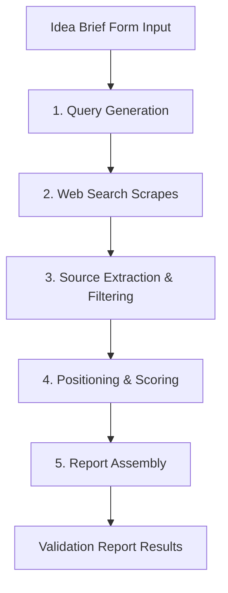

# SignalFit Validation Evidence Pipeline

The SignalFit validation pipeline transforms a raw product idea and target customer description into a structured, evidence-backed market analysis. 

---

## Pipeline Execution Stages

The pipeline consists of five sequential stages, coordinated asynchronously:

### 1. Query Generation (`lib/research/queries.ts`)
*   Takes the product idea, target customer, and target region.
*   Generates a matrix of targeted search queries focused on finding product signals (e.g. `Reddit complaint`, `manual workaround`, `pricing pages`, `competitor reviews`).

### 2. Search Provider Scrapes (`lib/research/providers.ts`)
*   Queries search engines (SerpAPI/Tavily in production; simulated via mock data in local dev).
*   Retrieves relevant web pages, thread contents, and reviews across 10+ source categories (Reddit, G2, Hacker News, Capterra, Product Hunt).

### 3. Source Extraction & Filtering (`lib/research/evidence.ts`)
*   Extracts raw snippet quotes and facts from scraped page sources.
*   Filters duplicate signals and low-confidence data points.
*   Assigns structural classifications: `Pain`, `Demand`, `Pricing`, or `Risk`.

### 4. Positioning & Scoring (`lib/scoring.ts`)
*   Maps competitor positioning, pricing strategies, and target segments.
*   Calculates a 12-factor opportunity score using customized criterion weights (e.g. Pain Severity, Purchase Urgency, Willingness to Pay).
*   Applies inverted regulatory and platform dependency risk formulas.

### 5. Report Assembly (`lib/research/generator.ts`)
*   Assembles the final JSON report payload structure, including executive summaries, competitor matrices, MVP blueprints (V0–V3), and the launch checklist.
*   Triggers real-time client-side redirection once complete.

---

## Local Development vs. Production Execution

*   **Local Development Pipeline**: Runs fully in-memory inside the Next.js runtime (`lib/research/pipeline.ts`). Transitions and stages are simulated dynamically, and queries/scrapes use mock providers to avoid third-party API costs.
*   **Production Pipeline**: Deployed in a background job architecture via a Supabase Database Webhook firing when a new `research_runs` row is inserted. A Supabase Edge Function (`supabase/functions/research-worker`) handles the queue, updates research stages in Postgres, and broadcasts progress updates to the client via Supabase Realtime channels.
