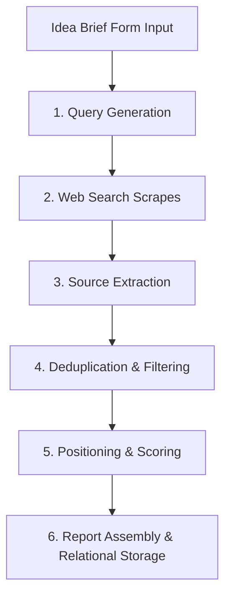

# SignalFit Validation Evidence Pipeline

The SignalFit validation pipeline transforms a raw product idea and target customer description into a structured, evidence-backed market analysis.

---

## Pipeline Execution Stages

The pipeline consists of six sequential stages, coordinated asynchronously:

### 1. Query Generation (`lib/research/queries.ts`)
*   Takes the product idea and target customer.
*   Generates a matrix of targeted search queries focused on finding product signals (e.g. `Reddit complaint`, `manual workaround`, `pricing pages`, `competitor reviews`).

### 2. Search Provider Scrapes (`lib/research/providers.ts` -> `TavilySearchProvider`)
*   Queries search engines using the Tavily Search API.
*   **Resource Cap**: Hard-capped at 5 search queries per run to stay within free-tier limits.
*   Retrieves relevant web pages, thread contents, and reviews across 10+ source categories (Reddit, G2, Hacker News, Capterra, Product Hunt).

### 3. Source Extraction (`lib/research/providers.ts` -> `FirecrawlExtractor`)
*   Extracts raw snippet quotes and facts from scraped page sources.
*   **Resource Cap**: Hard-capped at 3 unique page extractions per run using the Firecrawl API. No raw HTML reaches the LLM; only clean, parsed markdown.

### 4. Deduplication & Filtering (`lib/research/pipeline.ts` -> `deduplicateEvidence`)
*   Generates embeddings for extracted snippet texts using the Cohere API (`embed-english-v3.0`).
*   **Resource Cap**: Hard-capped at 2 batch embedding calls per run.
*   Deduplicates signals using a cosine similarity threshold of `0.85`.
*   Applies a fallback string-based Jaccard similarity threshold of `0.6` on embedding failures.

### 5. Positioning & Scoring (`lib/research/providers.ts` -> `GroqReasoningProvider`)
*   Primary Reasoning: Groq (`llama-3.3-70b-versatile`).
*   Fallback Reasoning: OpenRouter (`meta-llama/llama-3.3-70b-instruct:free`) triggered automatically on Groq rate-limits or transient failures.
*   **Resource Cap**: Hard-capped at 5 LLM calls per run (up to 4 for chunk extraction, 1 for final compilation).
*   Calculates a 12-factor opportunity score using customized criterion weights (e.g. Pain Severity, Purchase Urgency, Willingness to Pay).

### 6. Report Assembly & Relational Storage (`lib/research/pipeline.ts` -> `saveReportToDatabase`)
*   Synthesizes the final JSON report payload structure, including executive summaries, competitor matrices, MVP blueprints (V0–V3), and the launch checklist.
*   Persists all structured opportunities details relationally to tables: `opportunities`, `opportunity_scores`, `score_breakdowns`, `score_evidence_refs`, `evidence_items`, `sources`, `competitors`, `risks`, `pricing_models`, `mvp_plans`, `mvp_scope_items`, `launch_plans`, `launch_strategies`, `reports`, `report_versions`.
*   Triggers real-time client-side progress redirection.

---

## Observability & Logging (`api_usage_logs`)

All provider API requests are logged with success/failure statuses and token counts in the `api_usage_logs` table for budgeting and auditing. Row Level Security (RLS) is enabled on this table, ensuring that users can only view logs matching runs owned by their teams.

---

## Local Development vs. Production Execution

*   **Local Development Pipeline**: If `GROQ_API_KEY` and `TAVILY_API_KEY` are not configured in `.env.local`, the pipeline gracefully falls back to mock providers, using simulated responses and updating Next.js in-memory state.
*   **Production Pipeline**: Deployed in a background job architecture via a Supabase Database Webhook firing when a new `research_runs` row is inserted. A Supabase Edge Function (`supabase/functions/research-worker`) handles the queue, executing the real pipeline in the database environment.
